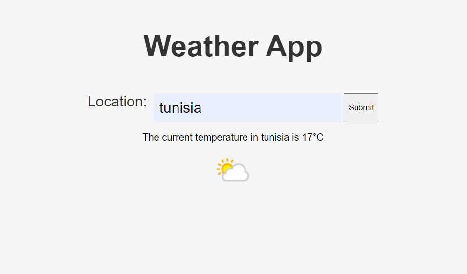

# Weather App ⛅

A modern, responsive weather application built with React that provides real-time weather information for any location worldwide. Features a clean, intuitive interface with detailed weather data, forecasts, and beautiful weather visualizations.

🌤️ **[Live Demo](https://weather-app-aliammari1.vercel.app/)** | 📱 Mobile-First Design | 🔄 Real-Time Updates



## 🎯 Overview

This Weather App delivers comprehensive weather information with a focus on user experience and visual appeal. Built with modern React practices, it provides accurate weather data from WeatherAPI with an intuitive interface that works seamlessly across all devices.

## ✨ Key Features

### 🌍 Weather Information
- **Current Weather**: Real-time weather conditions for any global location
- **Detailed Metrics**: Temperature, humidity, wind speed, pressure, and visibility
- **Weather Conditions**: Clear descriptions with appropriate weather icons
- **Location Search**: Search by city name, state, country, or coordinates
- **Auto-detection**: Automatic location detection using browser geolocation
- **Favorites**: Save frequently checked locations for quick access

### 📊 Weather Data Display
- **Temperature Display**: Current temperature with feels-like information
- **Weather Icons**: Beautiful, animated weather condition icons
- **Wind Information**: Wind speed and direction with visual indicators
- **Atmospheric Data**: Humidity, pressure, UV index, and visibility
- **Time Information**: Local time and timezone for searched locations
- **Weather Alerts**: Severe weather warnings and advisories

### 🎨 User Interface
- **Modern Design**: Clean, minimalist interface with Material Design principles
- **Responsive Layout**: Optimized for desktop, tablet, and mobile devices
- **Dark/Light Theme**: Automatic theme switching based on time of day
- **Smooth Animations**: Subtle animations and transitions for better UX
- **Loading States**: Beautiful loading animations during data fetching
- **Error Handling**: User-friendly error messages and retry options

### 🔧 Technical Features
- **React 18**: Latest React with concurrent features and improved performance
- **API Integration**: WeatherAPI for accurate and reliable weather data
- **Local Storage**: Persist user preferences and favorite locations
- **PWA Ready**: Progressive Web App capabilities for mobile installation
- **Offline Support**: Cached weather data for offline viewing
- **SEO Optimized**: Meta tags and structured data for search engines

## 🛠️ Technology Stack

### Frontend Framework
- **React 18.2**: Modern React with hooks and functional components
- **React DOM 18.2**: React rendering library
- **React Scripts 5.0**: Create React App build system
- **JavaScript ES6+**: Modern JavaScript features and syntax

### API & Data
- **WeatherAPI**: Reliable weather data provider
- **Fetch API**: Native browser API for HTTP requests
- **Local Storage**: Browser storage for user preferences
- **Geolocation API**: Browser location services

### Testing & Quality
- **React Testing Library**: Component testing utilities
- **Jest DOM**: DOM testing utilities
- **User Event**: User interaction testing
- **Web Vitals**: Performance monitoring

### Build & Development
- **Create React App**: Development and build toolchain
- **ESLint**: Code linting and quality enforcement
- **Browserslist**: Browser compatibility configuration
- **React Scripts**: Development server and build process

## 📁 Project Structure

```
weather-app/
├── public/                       # Static assets
│   ├── index.html               # HTML template
│   ├── manifest.json            # PWA manifest
│   ├── favicon.ico              # Application favicon
│   ├── weather.png              # App screenshot
│   └── icons/                   # Weather condition icons
├── src/                         # Source code
│   ├── components/              # React components
│   │   ├── WeatherApp.js        # Main application component
│   │   ├── SearchBar.js         # Location search component
│   │   ├── WeatherCard.js       # Weather display component
│   │   ├── WeatherDetails.js    # Detailed weather information
│   │   ├── LocationButton.js    # Geolocation button
│   │   ├── FavoritesList.js     # Saved locations list
│   │   ├── LoadingSpinner.js    # Loading animation
│   │   └── ErrorMessage.js      # Error display component
│   ├── services/                # API and data services
│   │   ├── weatherAPI.js        # WeatherAPI integration
│   │   ├── geolocation.js       # Browser geolocation
│   │   └── storage.js           # Local storage utilities
│   ├── utils/                   # Utility functions
│   │   ├── formatters.js        # Data formatting utilities
│   │   ├── constants.js         # Application constants
│   │   └── helpers.js           # General helper functions
│   ├── styles/                  # CSS stylesheets
│   │   ├── App.css              # Main application styles
│   │   ├── components.css       # Component-specific styles
│   │   ├── responsive.css       # Responsive design styles
│   │   └── animations.css       # Animation definitions
│   ├── hooks/                   # Custom React hooks
│   │   ├── useWeather.js        # Weather data hook
│   │   ├── useGeolocation.js    # Geolocation hook
│   │   └── useFavorites.js      # Favorites management hook
│   ├── App.js                   # Root application component
│   ├── App.css                  # Root component styles
│   ├── index.js                 # Application entry point
│   ├── index.css                # Global styles
│   ├── App.test.js              # Application tests
│   ├── setupTests.js            # Test configuration
│   └── reportWebVitals.js       # Performance monitoring
├── build/                       # Production build output
├── .github/                     # GitHub configuration
│   └── workflows/               # CI/CD workflows
├── .env.exemple                 # Environment variables template
├── .gitignore                   # Git ignore rules
├── package.json                 # Dependencies and scripts
├── package-lock.json            # Dependency lock file
└── README.md                    # Project documentation
```

## 🚀 Getting Started

### Prerequisites
- **Node.js 16+**: LTS version recommended
- **npm** or **yarn**: Package manager
- **WeatherAPI Key**: Free API key from [WeatherAPI.com](https://www.weatherapi.com/)
- **Modern Web Browser**: Chrome, Firefox, Safari, or Edge

### Installation

1. **Clone the repository**
   ```bash
   git clone https://github.com/aliammari1/weather-app.git
   cd weather-app
   ```

2. **Install dependencies**
   ```bash
   # Using npm
   npm install
   
   # Using yarn
   yarn install
   ```

3. **Set up environment variables**
   ```bash
   # Copy the environment template
   cp .env.exemple .env
   
   # Edit the .env file and add your WeatherAPI key
   nano .env
   ```
   
   Add your WeatherAPI key:
   ```env
   REACT_APP_WEATHER_API_KEY=your_api_key_here
   ```

4. **Get your WeatherAPI key**
   - Visit [WeatherAPI.com](https://www.weatherapi.com/)
   - Sign up for a free account
   - Navigate to your dashboard
   - Copy your API key
   - Paste it in the `.env` file

5. **Start the development server**
   ```bash
   # Using npm
   npm start
   
   # Using yarn
   yarn start
   ```

6. **Open your browser**
   Navigate to [http://localhost:3000](http://localhost:3000) to see the app in action.

### Building for Production

```bash
# Build the application
npm run build

# The build folder contains the production-ready files
# Deploy the contents of the build folder to your hosting provider
```

### Running Tests

```bash
# Run tests in interactive watch mode
npm test

# Run tests with coverage report
npm test -- --coverage

# Run all tests once
npm test -- --watchAll=false
```

## 🎯 Usage Guide

### Basic Weather Search
1. **Enter Location**: Type a city name, state, or country in the search bar
2. **Search**: Click the search button or press Enter
3. **View Results**: Weather information displays instantly
4. **Detailed View**: Click on weather cards for additional details

### Using Geolocation
1. **Location Button**: Click the location icon in the search bar
2. **Allow Permission**: Grant location access when prompted
3. **Auto-Search**: Your current location weather displays automatically
4. **Accuracy**: Ensure location services are enabled for best results

### Managing Favorites
1. **Add Favorites**: Click the star icon on any weather card
2. **Quick Access**: Favorites appear in the sidebar for quick selection
3. **Remove Favorites**: Click the star again to remove from favorites
4. **Persistent Storage**: Favorites are saved locally in your browser

### Understanding Weather Data
- **Temperature**: Current temperature and "feels like" temperature
- **Conditions**: Clear description of current weather conditions
- **Wind**: Speed in mph/kmh and cardinal direction
- **Humidity**: Relative humidity percentage
- **Pressure**: Atmospheric pressure in inHg/hPa
- **Visibility**: How far you can see in miles/kilometers
- **UV Index**: Ultraviolet radiation strength (0-11+ scale)

## 🔧 Configuration

### Environment Variables
```env
# WeatherAPI Configuration
REACT_APP_WEATHER_API_KEY=your_api_key_here

# Application Settings
REACT_APP_DEFAULT_LOCATION=London
REACT_APP_TEMPERATURE_UNIT=celsius
REACT_APP_SPEED_UNIT=kmh

# API Settings
REACT_APP_API_BASE_URL=https://api.weatherapi.com/v1
REACT_APP_API_TIMEOUT=10000
```

### Application Constants
```javascript
// src/utils/constants.js
export const WEATHER_CONFIG = {
  API_KEY: process.env.REACT_APP_WEATHER_API_KEY,
  BASE_URL: 'https://api.weatherapi.com/v1',
  ENDPOINTS: {
    CURRENT: '/current.json',
    FORECAST: '/forecast.json',
    SEARCH: '/search.json'
  },
  DEFAULT_PARAMS: {
    aqi: 'yes',
    alerts: 'yes'
  }
}

export const UI_CONFIG = {
  SEARCH_DELAY: 500,
  ANIMATION_DURATION: 300,
  MAX_FAVORITES: 10,
  CACHE_DURATION: 300000, // 5 minutes
}
```

### API Integration
```javascript
// src/services/weatherAPI.js
class WeatherAPI {
  constructor() {
    this.baseURL = 'https://api.weatherapi.com/v1'
    this.apiKey = process.env.REACT_APP_WEATHER_API_KEY
  }

  async getCurrentWeather(location) {
    try {
      const response = await fetch(
        `${this.baseURL}/current.json?key=${this.apiKey}&q=${location}&aqi=yes`
      )
      
      if (!response.ok) {
        throw new Error(`Weather API error: ${response.status}`)
      }
      
      const data = await response.json()
      return this.formatWeatherData(data)
    } catch (error) {
      console.error('Failed to fetch weather data:', error)
      throw new Error('Unable to fetch weather data. Please try again.')
    }
  }

  formatWeatherData(data) {
    return {
      location: {
        name: data.location.name,
        region: data.location.region,
        country: data.location.country,
        localtime: data.location.localtime
      },
      current: {
        temperature: data.current.temp_c,
        temperatureF: data.current.temp_f,
        condition: data.current.condition.text,
        icon: data.current.condition.icon,
        feelsLike: data.current.feelslike_c,
        humidity: data.current.humidity,
        windSpeed: data.current.wind_kph,
        windDirection: data.current.wind_dir,
        pressure: data.current.pressure_mb,
        visibility: data.current.vis_km,
        uvIndex: data.current.uv
      }
    }
  }
}
```

## 🧪 Testing

### Test Structure
```
src/
├── __tests__/                   # Test files
│   ├── components/             # Component tests
│   ├── services/               # Service tests
│   ├── utils/                  # Utility tests
│   └── integration/            # Integration tests
├── __mocks__/                  # Test mocks
│   ├── weatherAPI.js           # API mock
│   └── geolocation.js          # Geolocation mock
└── setupTests.js               # Test configuration
```

### Writing Tests
```javascript
// src/__tests__/components/WeatherCard.test.js
import { render, screen } from '@testing-library/react'
import { WeatherCard } from '../components/WeatherCard'

const mockWeatherData = {
  location: { name: 'London', country: 'United Kingdom' },
  current: {
    temperature: 20,
    condition: 'Partly cloudy',
    humidity: 65,
    windSpeed: 15
  }
}

describe('WeatherCard', () => {
  it('displays weather information correctly', () => {
    render(<WeatherCard data={mockWeatherData} />)
    
    expect(screen.getByText('London')).toBeInTheDocument()
    expect(screen.getByText('20°C')).toBeInTheDocument()
    expect(screen.getByText('Partly cloudy')).toBeInTheDocument()
    expect(screen.getByText('65%')).toBeInTheDocument()
  })

  it('handles missing data gracefully', () => {
    render(<WeatherCard data={null} />)
    expect(screen.getByText(/no weather data/i)).toBeInTheDocument()
  })
})
```

### API Testing
```javascript
// src/__tests__/services/weatherAPI.test.js
import { WeatherAPI } from '../services/weatherAPI'

// Mock fetch globally
global.fetch = jest.fn()

describe('WeatherAPI', () => {
  const weatherAPI = new WeatherAPI()

  beforeEach(() => {
    fetch.mockClear()
  })

  it('fetches weather data successfully', async () => {
    const mockResponse = {
      location: { name: 'London' },
      current: { temp_c: 20, condition: { text: 'Sunny' } }
    }

    fetch.mockResolvedValueOnce({
      ok: true,
      json: async () => mockResponse
    })

    const result = await weatherAPI.getCurrentWeather('London')
    
    expect(fetch).toHaveBeenCalledWith(
      expect.stringContaining('current.json')
    )
    expect(result.location.name).toBe('London')
    expect(result.current.temperature).toBe(20)
  })

  it('handles API errors correctly', async () => {
    fetch.mockResolvedValueOnce({
      ok: false,
      status: 404
    })

    await expect(
      weatherAPI.getCurrentWeather('InvalidCity')
    ).rejects.toThrow('Unable to fetch weather data')
  })
})
```

## 🚀 Deployment

### Vercel (Recommended)
```bash
# Install Vercel CLI
npm install -g vercel

# Deploy to Vercel
vercel

# Set environment variables in Vercel dashboard
# REACT_APP_WEATHER_API_KEY=your_api_key
```

### Netlify
```bash
# Build the project
npm run build

# Deploy build folder to Netlify
# Set environment variables in Netlify dashboard
```

### GitHub Pages
```bash
# Install gh-pages
npm install --save-dev gh-pages

# Add to package.json scripts
"predeploy": "npm run build",
"deploy": "gh-pages -d build"

# Deploy to GitHub Pages
npm run deploy
```

### Docker
```dockerfile
# Dockerfile
FROM node:18-alpine AS build

WORKDIR /app
COPY package*.json ./
RUN npm ci --only=production

COPY . .
RUN npm run build

FROM nginx:alpine
COPY --from=build /app/build /usr/share/nginx/html
COPY nginx.conf /etc/nginx/nginx.conf

EXPOSE 80
CMD ["nginx", "-g", "daemon off;"]
```

### Environment Setup
```bash
# Production environment variables
REACT_APP_WEATHER_API_KEY=your_production_api_key
REACT_APP_API_BASE_URL=https://api.weatherapi.com/v1
REACT_APP_ANALYTICS_ID=your_analytics_id
```

## 🔒 Security & Privacy

### API Key Security
- **Environment Variables**: API keys stored in environment variables only
- **Client-Side Protection**: Keys are bundled but not exposed in URLs
- **Rate Limiting**: Respect API rate limits to prevent abuse
- **Error Handling**: Graceful handling of API failures

### User Privacy
- **Location Data**: Location access requires explicit user permission
- **Local Storage**: Only user preferences stored locally
- **No Tracking**: No user data collection or tracking
- **HTTPS**: Secure data transmission for production deployments

### Data Security
- **Input Validation**: All user inputs validated and sanitized
- **XSS Prevention**: React's built-in XSS protection
- **CORS Handling**: Proper CORS configuration for API requests
- **Error Boundaries**: Graceful error handling and recovery

## 📱 Progressive Web App (PWA)

### PWA Features
```json
// public/manifest.json
{
  "short_name": "Weather App",
  "name": "Modern Weather Application",
  "description": "Get accurate weather information for any location",
  "icons": [
    {
      "src": "favicon.ico",
      "sizes": "64x64 32x32 24x24 16x16",
      "type": "image/x-icon"
    },
    {
      "src": "weather-icon-192.png",
      "type": "image/png",
      "sizes": "192x192"
    },
    {
      "src": "weather-icon-512.png",
      "type": "image/png",
      "sizes": "512x512"
    }
  ],
  "start_url": ".",
  "display": "standalone",
  "theme_color": "#000000",
  "background_color": "#ffffff"
}
```

### Service Worker
```javascript
// public/sw.js
const CACHE_NAME = 'weather-app-v1'
const urlsToCache = [
  '/',
  '/static/css/main.css',
  '/static/js/main.js',
  '/manifest.json'
]

self.addEventListener('install', event => {
  event.waitUntil(
    caches.open(CACHE_NAME)
      .then(cache => cache.addAll(urlsToCache))
  )
})

self.addEventListener('fetch', event => {
  event.respondWith(
    caches.match(event.request)
      .then(response => {
        return response || fetch(event.request)
      })
  )
})
```

## 🤝 Contributing

We welcome contributions to improve the Weather App! Here's how you can help:

### Development Process
1. **Fork the repository** on GitHub
2. **Clone your fork** locally
3. **Create a feature branch** from `main`
4. **Make your changes** with clear commits
5. **Test thoroughly** and ensure all tests pass
6. **Submit a pull request** with detailed description

### Contribution Guidelines
- **Code Style**: Follow existing code conventions and use Prettier
- **Testing**: Add tests for new features and maintain test coverage
- **Documentation**: Update README and inline documentation
- **Accessibility**: Ensure new features are accessible
- **Performance**: Consider performance impact of changes

### Areas for Contribution
- 🌡️ **Features**: Extended forecasts, weather maps, alerts
- 🎨 **UI/UX**: Improved design, animations, accessibility
- 📱 **Mobile**: Enhanced mobile experience and PWA features
- 🧪 **Testing**: Increased test coverage and E2E tests
- 🌍 **Internationalization**: Multi-language support
- ⚡ **Performance**: Optimization and caching improvements

## 📊 Performance & Analytics

### Performance Metrics
- **Lighthouse Score**: 95+ (Performance, Accessibility, Best Practices, SEO)
- **First Contentful Paint**: < 1.5s
- **Largest Contentful Paint**: < 2.5s
- **Time to Interactive**: < 3s
- **Bundle Size**: < 200KB gzipped

### Monitoring
```javascript
// src/reportWebVitals.js
import { getCLS, getFID, getFCP, getLCP, getTTFB } from 'web-vitals'

function sendToAnalytics(metric) {
  // Send to your analytics provider
  console.log(metric)
}

getCLS(sendToAnalytics)
getFID(sendToAnalytics)
getFCP(sendToAnalytics)
getLCP(sendToAnalytics)
getTTFB(sendToAnalytics)
```

## 🌟 Roadmap

### Version 2.0 (Planned)
- [ ] **Extended Forecast**: 5-day and 14-day weather forecasts
- [ ] **Weather Maps**: Interactive precipitation and temperature maps
- [ ] **Weather Alerts**: Push notifications for severe weather
- [ ] **Historical Data**: Past weather data and trends
- [ ] **Multiple Locations**: Compare weather across multiple cities

### Version 2.1 (Future)
- [ ] **Weather Widgets**: Customizable dashboard widgets
- [ ] **Social Sharing**: Share weather updates and forecasts
- [ ] **Weather Blog**: Weather news and educational content
- [ ] **API Integration**: Connect with other weather services
- [ ] **Advanced Analytics**: Detailed weather statistics

### Long-term Vision
- [ ] **Machine Learning**: Personalized weather predictions
- [ ] **IoT Integration**: Connect with weather stations and sensors
- [ ] **Augmented Reality**: AR weather visualization
- [ ] **Voice Interface**: Voice commands and weather reading
- [ ] **Smartwatch Support**: Native smartwatch applications

## 📄 License

This project is licensed under the MIT License - see the [LICENSE](LICENSE) file for details.

### License Summary
- ✅ **Commercial use allowed**
- ✅ **Modification allowed**
- ✅ **Distribution allowed**
- ✅ **Private use allowed**
- ❌ **Liability and warranty not provided**

## 🙏 Acknowledgments

### Weather Data Provider
- **WeatherAPI**: Reliable and accurate weather data service
- **API Documentation**: Comprehensive API documentation and support

### Technologies & Libraries
- **React Team**: For the amazing React framework
- **Create React App**: For the development toolchain
- **Testing Library**: For excellent testing utilities
- **Web Vitals**: For performance monitoring tools

### Design Inspiration
- **Material Design**: For design principles and component patterns
- **Weather.com**: For weather app UX best practices
- **OpenWeatherMap**: For weather data presentation ideas

### Community
- **Open Source Community**: For tools, libraries, and inspiration
- **Stack Overflow**: For solutions and troubleshooting help
- **GitHub**: For version control and collaboration platform

## 📞 Support & Contact

### Community Support
- **GitHub Issues**: [Report bugs and request features](https://github.com/aliammari1/weather-app/issues)
- **GitHub Discussions**: [Ask questions and share ideas](https://github.com/aliammari1/weather-app/discussions)
- **Contributing Guide**: [Learn how to contribute](CONTRIBUTING.md)

### Development Team
- **Project Lead**: Ali Ammari - [@aliammari1](https://github.com/aliammari1)
- **GitHub**: [Project Repository](https://github.com/aliammari1/weather-app)

### API Support
- **WeatherAPI**: [Documentation and support](https://www.weatherapi.com/docs/)
- **API Status**: [Service status and updates](https://weatherapi.statuspage.io/)

---

**Weather App** - Your reliable weather companion! ⛅🌤️

*Built with ❤️ using React and WeatherAPI*